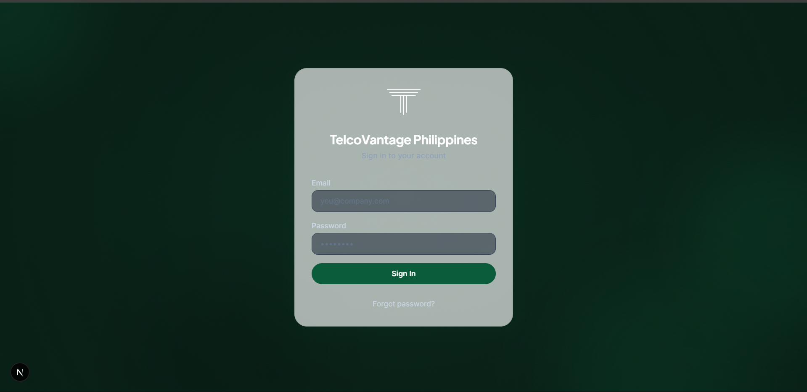

# TelcoVantage ERP System



> **The Intelligent Command Surface for TelcoVantage Philippines.**

A state-of-the-art Enterprise Resource Planning (ERP) system designed to modernize vendor management, financial tracking, project oversight, and document compliance for TelcoVantage. Built with **Next.js 16**, **Supabase**, and **Google Gemini AI**.

---

## Core Features

### Command Center
Real-time operational pulse with high-level metrics on **Current Liability**, **Active POs**, **Pending Vendors**, and **Expiring Documents**. Featuring a unified audit log and daily operational summaries.

### Vendor Management
Full vendor lifecycle management including profile details (banking, contacts, TIN), status tracking (pending/active/inactive), secondary contacts and banking, and multi-currency support (PHP/USD).

### 14-Point Compliance Hub
Advanced accreditation tracking system that monitors 14 critical vendor documents (NDA, SEC, PCAB, ISO, DOLE 174, etc.) in real-time.
- **Document Status Tracking**: Track each document through not_submitted → submitted → approved → expired.
- **Accreditation Matrix**: A visual grid to monitor the compliance health of the entire vendor ecosystem.

### Projects & Contracts
- **Project Management**: Create and manage projects with status tracking, description, and contract references.
- **Vendor-Project Linking**: Assign vendors to projects with safety checks preventing unlinking when open POs or unpaid invoices exist.
- **Master Contract Repository**: Full contract lifecycle with start/end dates, total value, file attachments, and status tracking.

### Purchase Orders
End-to-end PO management with:
- **Auto-numbering**: PO-YYYY-XXXX format via database trigger.
- **NDA Gate**: Requires approved NDA before PO creation.
- **Project Assignment**: Link POs to specific projects and internal entities.
- **Status Workflow**: draft → issued → partially_paid → paid / overpaid / cancelled.

### Financial Management
- **Service Invoices**: Link multiple invoices to a single PO with automatic balance calculation.
- **PO Amount Guard**: Prevents invoice amounts exceeding remaining PO capacity.
- **Payment Monitoring**: Record payments (full/installment/down payment) with auto-updating invoice and PO status.
- **Overpayment Detection**: Red warning banners and override capability for authorized roles.
- **Billing Health Visualization**: Progress rings and percentage bars showing invoiced vs PO amounts.

### AI Assistant (Gemini 2.5 Flash)
An integrated AI assistant powered by Google Gemini that understands the ERP's entire context.
- **Document Analysis**: Upload a PDF and ask questions about its content (summaries, key terms, obligations).
- **Proactive Navigation**: Ask the bot about vendor status, and it will provide direct deep-links and compliance insights.
- **Intelligent Search**: Find anything in the system using natural language with 8 custom tools (vendors, POs, compliance, financials, documents).

### Document Repository
Centralized document management divided into:
- **Company Library**: 4 folders — Legal & Compliance, HR & Staffing, Financials, Company Templates.
- **Vendor Vault**: Per-vendor document grid with compliance health indicators and full-screen preview (PDF, images, Office files via Google Docs viewer).

### Audit Logs
Comprehensive activity tracking across all entities (CREATE/UPDATE/DELETE) with:
- Dedicated audit log page with filters by action and entity type.
- Contextual audit log card on relevant pages with infinite scroll.

### Real-time Notifications
In-app notification system via Supabase Realtime subscriptions:
- 6 notification types (PO, invoice, payment, document, vendor, HR).
- Notification bell dropdown with mark-all-read and delete.
- 30-day auto-cleanup of old notifications.

### Global Search
Cmd+K search modal with keyboard navigation, searching across vendors, POs, invoices, projects, payments, and documents.

### System Control Panel
Settings page with 3 tabs:
- **Organization**: Company name, address, contact info.
- **Team Management**: User role management (admin/finance/procurement/project_manager/user) with HR invite via Supabase Admin API.
- **Financials**: VAT rate, payment terms, currency defaults.

### User Profiles
Profile management with name, avatar upload, and password reset.

### Theme Toggle
Dark/light mode via `next-themes` with class-based switching, default dark mode, and system preference detection.

---

## Technology Stack

- **Frontend**: Next.js 16.2.4 (App Router, `cacheComponents`), React 19.2.4, Tailwind CSS 4, Lucide Icons, Framer Motion.
- **Backend-as-a-Service**: Supabase (Auth, PostgreSQL, Realtime, Storage, RLS).
- **Intelligence**: Google Gemini AI (v2.5 Flash) via Vercel AI SDK (`ai`, `@ai-sdk/google`).
- **PDF Generation**: `pdf-lib` with fillable PO template and embedded font support.
- **Validation**: Zod 4 for schema validation.
- **Type Safety**: TypeScript 5+ with strict mode.
- **Styling**: Custom Design System based on [theme.md](theme.md).
- **Theme**: Next Themes with dark/light mode.

### Coming Soon
- **Scheduled Tasks**: Daily cron jobs for compliance expiry checks and overdue invoice reminders.
- **Email Notifications**: Transactional emails via Resend for document expiry alerts and invoice reminders.
- **Automated Expiry Warnings**: Proactive notification logic with email fallback.

---

## Getting Started

### Prerequisites
- Node.js 20+
- Supabase Project
- Google Gemini API Key

### Installation

1. **Clone the repository**:
   ```bash
   git clone https://github.com/jonrenzo/tvph-erp-system.git
   cd tvph-erp-system
   ```

2. **Install dependencies**:
   ```bash
   npm install
   ```

3. **Environment Setup**:
   Create a `.env.local` file with the following:
   ```env
   NEXT_PUBLIC_SUPABASE_URL=your_supabase_url
   NEXT_PUBLIC_SUPABASE_ANON_KEY=your_supabase_anon_key
   SUPABASE_SERVICE_ROLE_KEY=your_service_role_key
   GOOGLE_GENERATIVE_AI_API_KEY=your_gemini_key
   ```

4. **Database Setup**:
   Apply the migration to your Supabase project:
   ```bash
   # Run the initial schema migration via Supabase SQL Editor
   # Copy the contents of supabase/migrations/20250514_initial_schema.sql
   # and execute it in your Supabase project's SQL Editor.
   ```

5. **Run the development server**:
   ```bash
   npm run dev
   ```

---

## Architecture

- **Server-First**: Heavy use of React Server Components (RSC) and Server Actions for performance and security.
- **AI Tooling**: Tools defined in `lib/chat/tools.ts` (8 tools) allow Gemini to securely interact with the database via defined API boundaries with role-based access checks.
- **Security**: Row-Level Security (RLS) enabled on all tables, with role-based access checks (admin, finance, procurement, project_manager) in Server Actions.
- **Auth Proxy**: `proxy.ts` handles session refresh, root-level redirects (authenticated → `/dashboard`, unauthenticated → `/login`), and protects all `/dashboard/*` routes.
- **Real-time**: Supabase Realtime subscriptions power the notification bell and live updates.
- **Audit Trail**: All mutations go through `recordAuditLog()` in `utils/audit.ts` for full traceability.

---

## License

Internal Project for TelcoVantage Philippines. All Rights Reserved.
